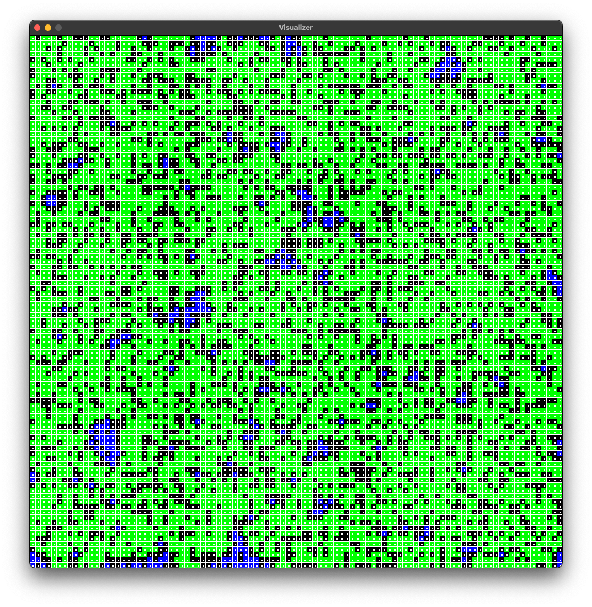
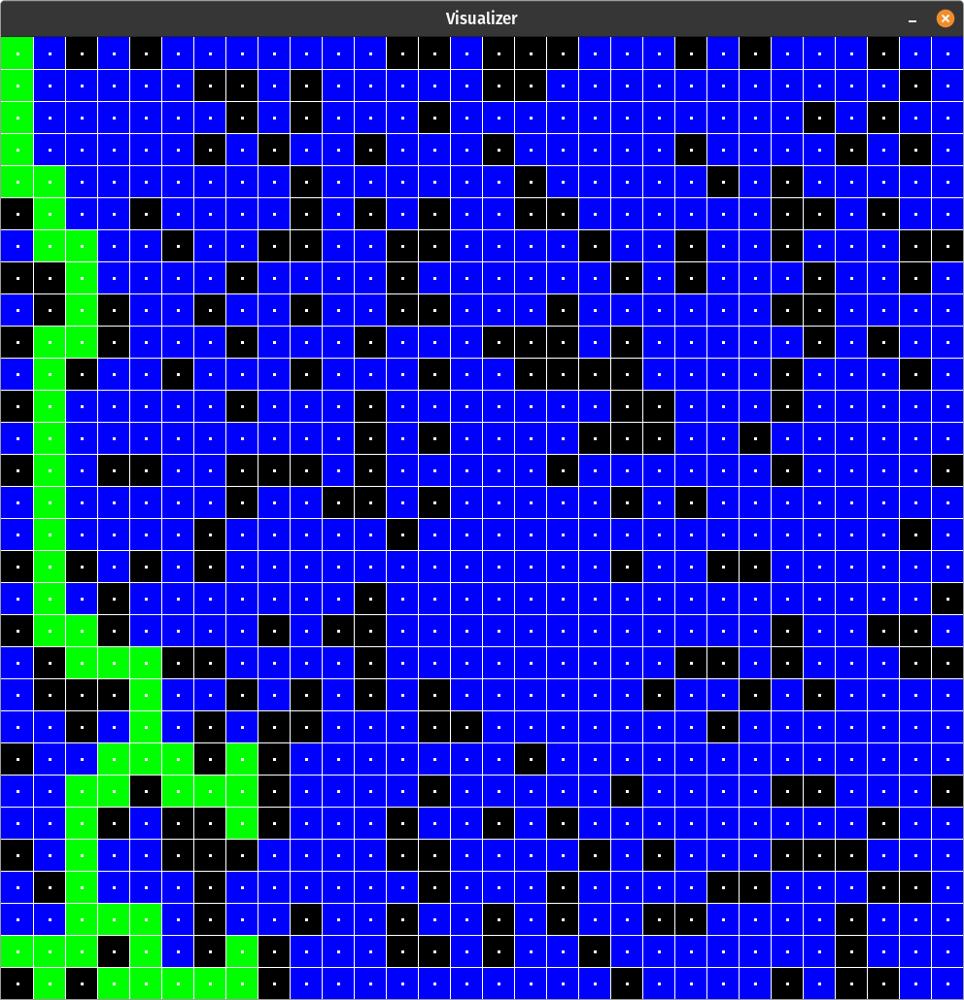

# astarviz

## A A\* algorithm visualizer coded in Python

Actually, this is a implementation of A\* algorithm. Optimize with pairing heap for time efficient find min distance.
Graph is stored in hybrid dictionary list format.

## Feature to be added

😊 Please contribute if you have any

- [] priority heap or pairing heap with decrease-key operation
- [] uses pyglet with shader

## Example

### **Dijkstra visualisation**

### **A\* visualisation**

## Precaution

Execute the following line of code if needed

1. Execute `export DISPLAY=':1'`

## Instruction

To run the application the visualizer, run command
`python astar.py`
